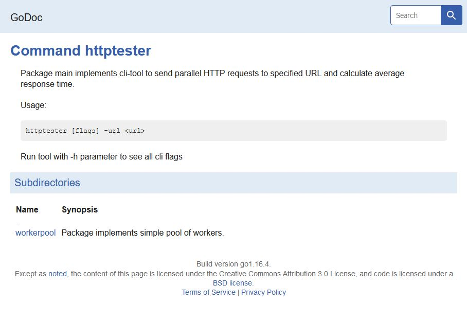
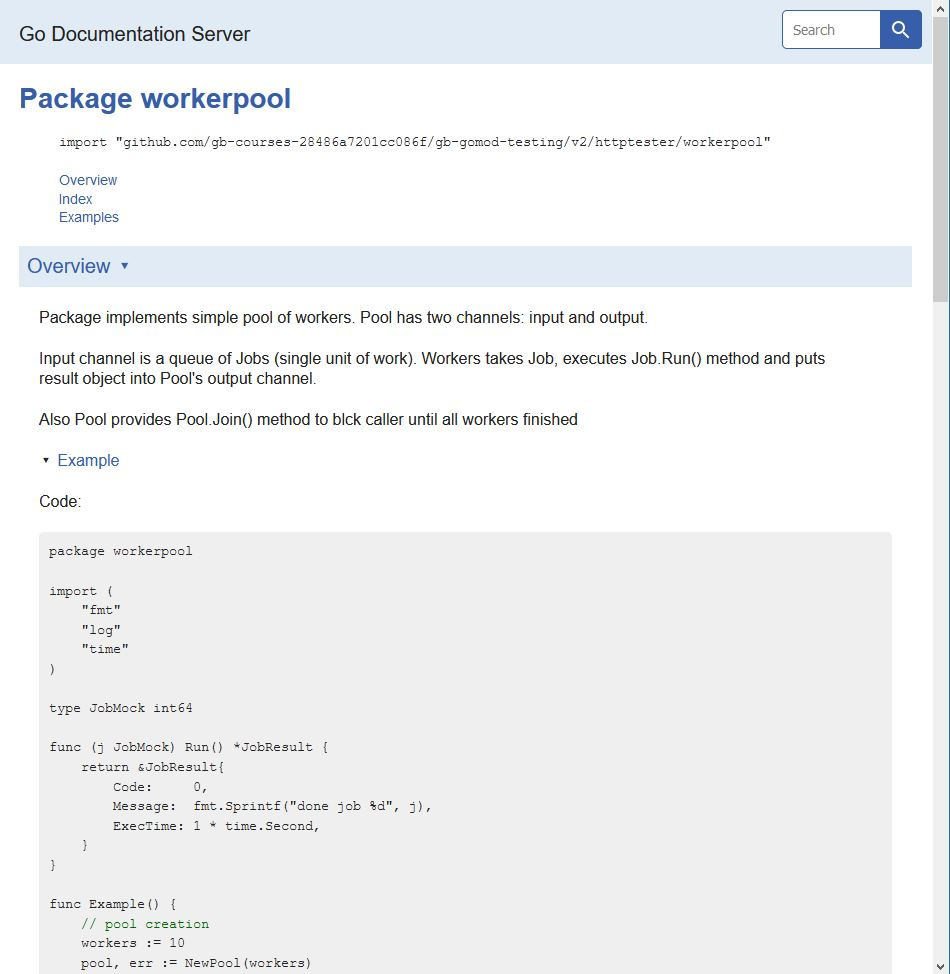

### Кросс-компиляция

Из под linux (wls2):
```
vshatskikh@VSHATSKIKH01:~/MyProjects/gb/gb-gomod-testing/v2/build$ uname -a
Linux VSHATSKIKH01 5.4.72-microsoft-standard-WSL2 #1 SMP Wed Oct 28 23:40:43 UTC 2020 x86_64 x86_64 x86_64 GNU/Linux
vshatskikh@VSHATSKIKH01:~/MyProjects/gb/gb-gomod-testing/v2/build$ go env GOOS GOARCH
linux
amd64
vshatskikh@VSHATSKIKH01:~/MyProjects/gb/gb-gomod-testing/v2/build$ 
```

скомплировано 2 файла:
1) под "родную" платформу
    ```
    vshatskikh@VSHATSKIKH01:~/MyProjects/gb/gb-gomod-testing/v2/build$ go build -o httptester ../httptester/*.go
    vshatskikh@VSHATSKIKH01:~/MyProjects/gb/gb-gomod-testing/v2/build$ file httptester 
    httptester: ELF 64-bit LSB executable, x86-64, version 1 (SYSV), dynamically linked, interpreter /lib64/ld-linux-x86-64.so.2, Go BuildID=EBcWrjYsQ4CVxJkzvhSE/9Kn3C-vrWq866fwNgIp9/iZYuJPa2LYauHFU8F79W/FGiXAQLLZk8jL1LggVub, not stripped
    vshatskikh@VSHATSKIKH01:~/MyProjects/gb/gb-gomod-testing/v2/build$ 
    ```

2) под windows
    ```
    vshatskikh@VSHATSKIKH01:~/MyProjects/gb/gb-gomod-testing/v2/build$ GOOS=windows go build -o httptester.exe ../httptester/*.go
    vshatskikh@VSHATSKIKH01:~/MyProjects/gb/gb-gomod-testing/v2/build$ file httptester.exe 
    httptester.exe: PE32+ executable (console) x86-64 (stripped to external PDB), for MS Windows
    vshatskikh@VSHATSKIKH01:~/MyProjects/gb/gb-gomod-testing/v2/build$
    ```

Пробовал запускать и на линуксе, и на винде: оба файла работают.
Разница в скорости: "родной" быстрый, "чужой" тормозит.

Правда, я ожидал, что "чужой" упадет с ошибкой.

### Документация

Добавлена документация к пакетам:

* httptester

     

* workerpool

    